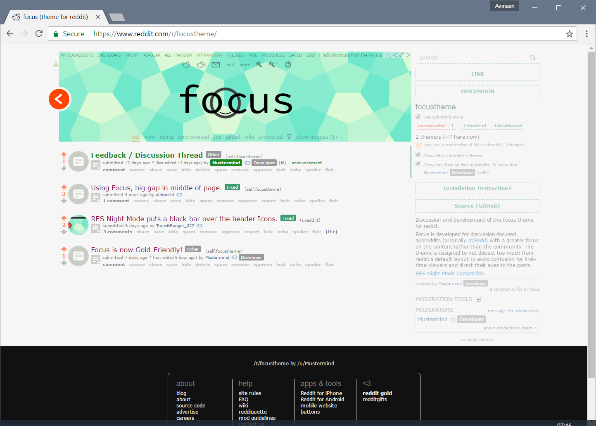

### focus – theme for reddit (beta)

[**Subreddit / Demo**](https://www.reddit.com/r/focustheme)

#### Installation

- Copy all the images from `images` to your subreddit, preserving the original file names.
- Set a square or circular header image in your subreddit settings.
- Compile the SCSS using your tool of choice (`sass theme/main.scss`).
- Copy and paste the CSS to your subreddit.
- Alternatively, there's a script in ./bin/publish that you might find interesting.

#### License

This theme is provided under MIT License. I also request that you leave the attribution text in the theme unchanged.

#### Image Credits

- The header background is **"Small Steps", CC-BY-SA 3.0 - Subtle Patterns © Toptal Designers**.
- All other images are licensed **CC-BY-SA 3.0 - Avinash Dwarapu**.

