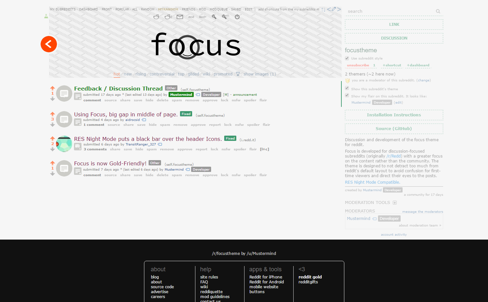

### focus – theme for reddit (beta)

[**Subreddit / Demo**](https://www.reddit.com/r/focustheme)

#### Features

- Customizable subreddit logo and header background.
- Subtle round "back to reddit" button.
- Compatible with RES and RES Night Mode.
- Aliases for "subscribers" and "users" in sidebar.
- Multicolor user and link flairs.
- Large buttons in sidebar text.
- Circular fixed-size thumbnail images.
- Also works as a gold theme for all subreddits.

#### Installation

1. Copy all the images from `images` to your subreddit, preserving the original file names.
2. Set a square or circular header image in your subreddit settings.
3. Compile the SCSS using your tool of choice (`sass theme/main.scss`).
4. Copy and paste the CSS to your subreddit.
5. Alternatively, there's a script in ./bin/publish that automates steps 3 and 4.

#### License

This theme is provided under MIT License. I also request that you leave the attribution text in the theme unchanged.

#### Image Credits

- The header background is **"Small Steps", CC-BY-SA 3.0 - Subtle Patterns © Toptal Designers**.
- All other images are licensed **CC-BY-SA 3.0 - Avinash Dwarapu**.

